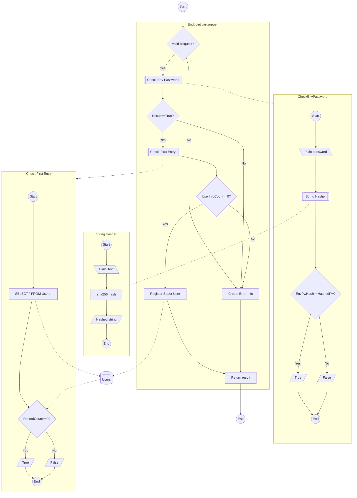

# Initialize Super User

## Flow

```mermaid

graph
direction TB

St(("Start")) --> ChReqPayload{"Valid Request?"};

subgraph StHash["String Hasher"]
    direction TB;
    StHashSt(("Start")) --> StringHashInput[\"Plain Text"\] --> Sh256["sha256 hash"];
    Sh256 --> StringHashOutput[/"Hashed string"/];
    StringHashOutput --> StHashEnd(("End"))
end

subgraph EPInit["Endpoint '/initsupuer'"]
    ChReqPayload --"Yes"--> ChEnvPw[["Check Env Password"]];
    ChReqPayload --"No"--> CreateError["Create Error Info"];
    ChEnvPw --> ChEnvRes{"Result==True?"}
    ChEnvRes --"Yes"--> ChDbSingle[["Check First Entry"]];
    ChEnvRes --"No"--> CreateError;
    ChDbSingle --> NoUser{"UserInfoCount==0?"};
    NoUser --"Yes"--> RegSuper["Register Super User"];
    NoUser --"No"--> CreateError;
    RegSuper --> EPInitRetResult["Return result"];
    CreateError --> EPInitRetResult;
end

EPInitRetResult --> EPInitEnd(("End"));

subgraph ChEnvP["CheckEnvPassword"]
    direction TB
    ChEnvPSt(("Start")) --> PlPassWd[\"Plain password"\];
    PlPassWd --> HashPlPassWd[["String Hasher"]];
    HashPlPassWd --> isEPwMatch{"EnvPwHash==HashedPw?"};
    isEPwMatch --"Yes"--> ChEnvPRetTrue[/"True"/];
    isEPwMatch --"No"--> ChEnvPRetFalse[/"False"/];
    ChEnvPRetTrue --> ChEnvPEnd(("End"));
    ChEnvPRetFalse --> ChEnvPEnd;
end

subgraph ChFirstEntry["Check First Entry"]
    ChFEntSt(("Start")) --> SelectSQL["SELECT * FROM Users;"];
    SelectSQL --> recCount{"RecordCount==0?"};
    recCount --"Yes"--> ChFEntRetTrue[/"True"/];
    recCount --"No"--> ChFEntRetFalse[/"False"/];
    ChFEntRetTrue --> ChFEntEnd(("End"));
    ChFEntRetFalse --> ChFEntEnd;
end

HashPlPassWd -.- StHash;
ChEnvPw -.- ChEnvP;
ChDbSingle -.-> ChFirstEntry;
SelectSQL -.-> UsersTbl[("Users")];
UsersTbl -.-> recCount;
RegSuper -.-> UsersTbl;

```
